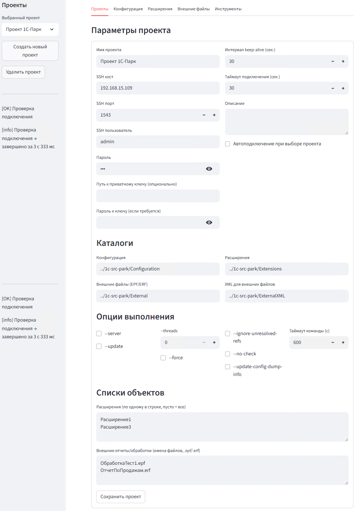
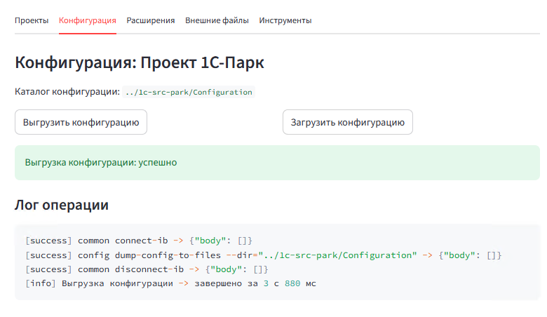
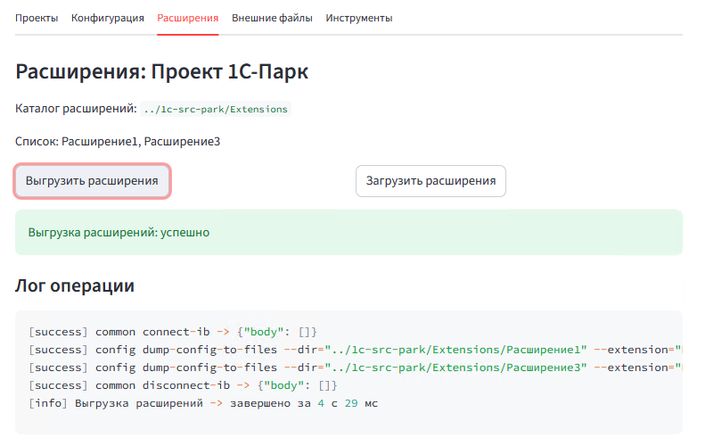
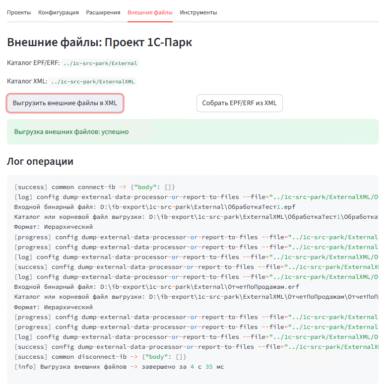
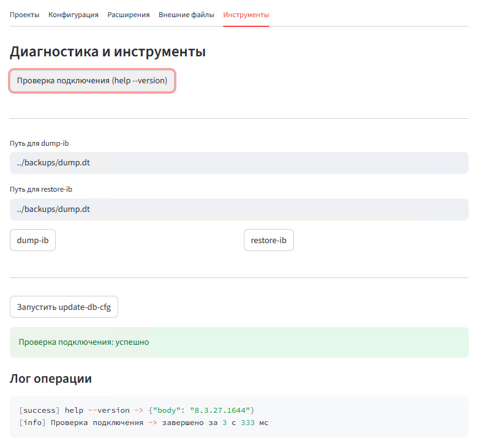

# 1C Agent UI (Streamlit)

UI обертка на Streamlit для удалённой работы с агентом конфигуратора 1С через SSH. Позволяет управлять выгрузкой/загрузкой основной конфигурации, расширений и внешних отчётов/обработок, видеть ход выполнения в JSON‑режиме и хранить набор подключений (Проекты) локально.

## Для чего?

Позволяет быстро выгружать / загружать исходники:
- основной конфигурации 1С
- расширений (по списку имён или все разом)
- внешних обработок/отчётов (EPF/ERF)
- скриншоты в самом конце

## Возможности
- Несколько «Проектов» (хранятся локально в `~/.1c-agent-ui/projects.json`, пароли обфусцируются).
- Подключение к агенту 1С по SSH, автоматическая настройка JSON‑вывода и прогресса.
- Операции:
  - Выгрузка/загрузка основной конфигурации в файловую структуру.
  - Выгрузка/загрузка расширений (по списку имён или все разом). При выгрузке по именам каждая в свой подкаталог.
  - Выгрузка/сборка внешних обработок/отчётов EPF/ERF ↔ XML (каждая в свой подкаталог `<Имя>/<Имя>.xml`).
- Служебные команды: `help --version`, `update-db-cfg`, `dump-ib`/`restore-ib`.
- Минимальный HTTP API (FastAPI) для запуска ключевых операций через GET‑запросы.
- Детальные логи с типами сообщений и итоговым временем операции.
- Блокировка кнопок во время выполнения, очередь операции, настраиваемый таймаут команды.

Примечание: все удалённые пути задаются относительно стартового каталога пользователя на стороне агента (например, `../1c-src-park`).

---

## Запуск (локально, Python)

Требования: Python 3.11+ (рекомендуется 3.12/3.13), доступ к сети до узла с агентом 1С.

1) Создать и активировать виртуальное окружение:

```
python -m venv venv
source venv/bin/activate   # Linux/macOS
# или
venv\Scripts\activate     # Windows
```

2) Установить зависимости:

```
pip install -r requirements.txt
```

3) Запустить приложение:

```
streamlit run streamlit_app.py
```

По умолчанию интерфейс будет доступен на http://localhost:8501

Для запуска HTTP API используйте:

```
uvicorn app.api:app --host 0.0.0.0 --port 8000
```

Оба процесса можно запускать одновременно в отдельных терминалах.

Опционально можно задать переменную окружения `ONEC_AGENT_UI_SECRET_SALT` для соли обфускации паролей.

### Диагностика задержек (клиентский трейс)

Для вывода подробного тайминга шагов клиента (установка SSH‑канала, чтение баннера, инициализация сессии агента) установите переменную окружения перед запуском:

```
export ONEC_AGENT_UI_DEBUG_TRACE=1
streamlit run streamlit_app.py
```

Трейс будет появляться в логе операции в UI с префиксом `[client]`.

---

## Запуск в Docker

Сборка образа и запуск контейнера со Streamlit:

```
docker build -t 1c-agent-ui .
docker run --rm -p 8501:8501 \
  -p 8000:8000 \
  -v 1c-agent-ui:/root/.1c-agent-ui \
  1c-agent-ui
```

Интерфейс: http://localhost:8501  
HTTP API: http://localhost:8000

Чтобы настройки проектов (файл `~/.1c-agent-ui/projects.json`) сохранялись между пересозданиями контейнера, смонтируйте том:

```
# вариант с именованным томом Docker
docker volume create 1c-agent-ui
docker run --rm -p 8501:8501 \
  -p 8000:8000 \
  -v 1c-agent-ui:/root/.1c-agent-ui \
  1c-agent-ui

# или вариант с каталогом хоста
docker run --rm -p 8501:8501 \
  -p 8000:8000 \
  -v $(pwd)/.1c-agent-ui:/root/.1c-agent-ui \
  1c-agent-ui
```

---

## Запуск через Docker Compose

В репозитории есть `docker-compose.yml`. Запустить можно так:

```
docker compose up -d --build
```
- Порты по умолчанию: 8501 (Streamlit) и 8000 (HTTP API).
- В `docker-compose.yml` уже добавлено сохранение настроек в именованный том:

```
services:
  streamlit-app:
    volumes:
      - 1c-agent-ui:/root/.1c-agent-ui

volumes:
  1c-agent-ui:
```

При необходимости можно заменить на монтирование директории с хоста.

---

## HTTP API
- [Документация по REST‑эндпоинтам и примеры запросов](docs/api.md).
- API доступно на http://localhost:8000 и позволяет вызывать основные операции агента одной ссылкой.

---

## Быстрые подсказки
- Перед выполнением операций убедитесь, что агент конфигуратора 1С запущен на целевом сервере и доступен по SSH.
- В настройках проекта укажите:
  - SSH параметры (хост, порт, пользователь, пароль/ключ).
  - Относительные директории для конфигурации/расширений/внешних файлов и XML.
  - По необходимости настройте `Таймаут команды (с)` для долгих операций.
- Для расширений по именам файлы складываются в подкаталоги `../Extensions/<ИмяРасширения>`.
- Для внешних обработок/отчётов XML‑структура — в `../ExternalXML/<Имя>/<Имя>.xml`.

## Запуск конфигуратора 1С в агентском режиме
Пример команды запуска для PowerShell:

```
& "C:\Program Files (x86)\1cv8\common\1cestart.exe" DESIGNER /F "D:\projects\proj-park\base" /N "admin" /P "123" /AgentMode /AgentListenAddress 0.0.0.0 /AgentSSHHostKeyAuto /AgentBaseDir "D:\projects\proj-park" /Visible
```
- AgentBaseDir - ключевой параметр, относительно этой директории (на один уровень выше) всё будет работать.

---

## Структура
- `app/` — код приложения (модели, SSH/agent‑клиент, хранилище проектов, UI).
- `app/api.py` — FastAPI‑приложение для минимального HTTP API.
- `streamlit_app.py` — точка входа Streamlit.
- `requirements.txt` — зависимости.
- `Dockerfile`, `docker-compose.yml` — контейнеризация.
- `start_services.py` — запуск Streamlit и FastAPI внутри одного контейнера/процесса разработки.
- `docs/api.md` — документация по HTTP API.

Если возникнут вопросы по командам агента — см [Работа конфигуратора в режиме агента](docs/docs-1c-agent.md).

## Скриншоты










