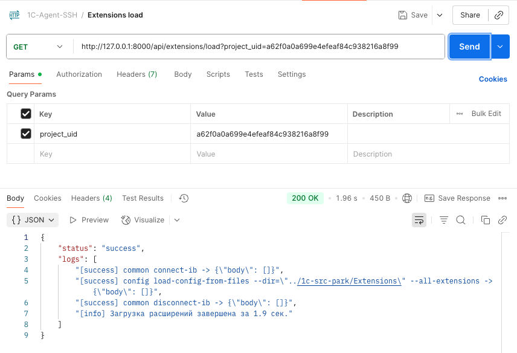
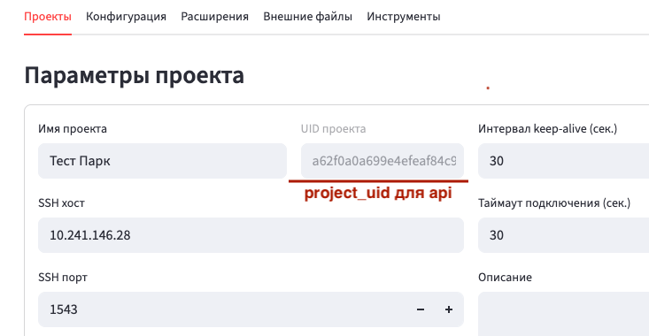

# HTTP API для 1C Agent UI

Минимальный HTTP API позволяет запускать базовые операции 1C‑агента без Streamlit‑интерфейса. API реализовано на FastAPI и доступно на порту `8000` того же сервиса, что и Streamlit.

## Общие сведения

- Базовый URL: `http://<host>:8000`
- Авторизация отсутствует.
- Все методы — `GET`.
- Обязательный параметр — `project_uid` (UUID). Допустимы значения вида `xxxxxxxx-xxxx-xxxx-xxxx-xxxxxxxxxxxx` и `xxxxxxxxxxxxxxxxxxxxxxxxxxxxxxxx`.
- Запрос выполняется синхронно: соединение держится до окончания операции.
- Одновременное исполнение нескольких операций запрещено. Запросы обслуживаются последовательно.

## Формат ответа

```json
{
  "status": "success" | "error" | "cancel",
  "logs": [
    "[12:00:01] init session...",
    "[12:00:03] executing: dump-cfg ../out/cfg.cf"
  ]
}
```

- Возвращается максимум 500 строк логов. Если строк больше, начало усечено и первой строкой добавляется пометка `"[лог усечён до последних 500 строк]"`.
- В логах нет секретов; вывод соответствует политикам UI.
- HTTP‑коды: `200` — операция завершилась корректно (в том числе если `status = "error"` от агента), `400` — ошибка запроса, `404` — проект не найден, `500` — внутренняя ошибка (например, сбой SSH).

## Эндпоинты

| Назначение | Метод | Путь |
|------------|-------|------|
| Выгрузка конфигурации | GET | `/api/config/dump` |
| Загрузка конфигурации | GET | `/api/config/load` |
| Выгрузка расширений | GET | `/api/extensions/dump` |
| Загрузка расширений | GET | `/api/extensions/load` |
| Экспорт внешних файлов в XML | GET | `/api/externals/export-xml` |
| Сборка внешних файлов из XML | GET | `/api/externals/build-from-xml` |

## Примеры

```bash
# Выгрузка основной конфигурации
curl -sS "http://localhost:8000/api/config/dump?project_uid=11111111-1111-1111-1111-111111111111"

# Выгрузка расширений
curl -sS "http://localhost:8000/api/extensions/dump?project_uid=11111111-1111-1111-1111-111111111111"

# Экспорт внешних файлов в XML
curl -sS "http://localhost:8000/api/externals/export-xml?project_uid=11111111-1111-1111-1111-111111111111"
```



## Запуск

Локально:

```bash
uvicorn app.api:app --host 0.0.0.0 --port 8000
```

Через Docker:

```bash
docker build -t 1c-agent-ui .
docker run --rm -p 8501:8501 -p 8000:8000 -v 1c-agent-ui:/root/.1c-agent-ui 1c-agent-ui
```

Docker Compose (по умолчанию порты 8502 → Streamlit и 8000 → API):

```bash
docker compose up -d --build
```
