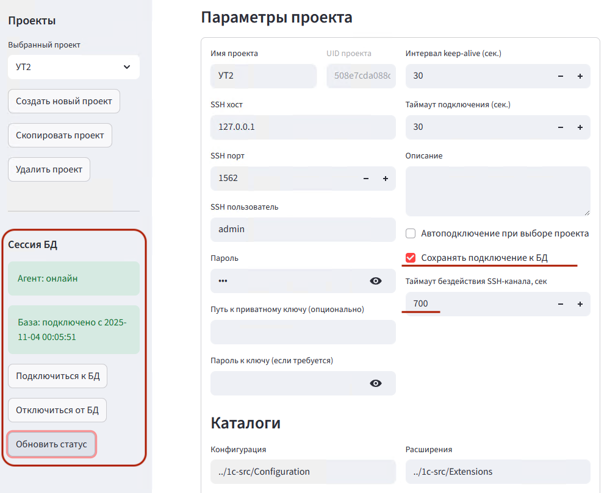

# Релиз 1.02 — Управление состоянием подключений

Добавлена возможность сохранять подключение к агенту конфигуратора 1С.



- Это ускоряет выполнение команд выгрузки / загрузки исходников.
- Для расширений или внешних отчетов и обработок это работает настолько быстро, что позволяет простыми http запросами (например, через curl) реализовать feedback loop для llm-агента, когда он выполняет задачи генерации метаданных или формы.

Я попробовал добавлять в промпт такой текст (сборка расширений):

>Сборку выполняй командой в PowerShell:
> 
>```powershell
>curl -sS "http://localhost:8000/api/extensions/load?project_uid=508e7cda088c456bb6cbd9cb0926d4d4"
>```
>
>Добейся результата со статусом success.
>
>Если получаешь статус error с ошибкой сборки, то выполняй следующий цикл:
>1. Прочитай еще несколько разных Документов из основной конфигурации: `1c-src/Configuration/Documents/*.xml`
>2. Сверь и исправь текущий документ в соответствии с примерами из основной конфигурации
>3. Повтори сборку
>
>Остановись если не получается добиться сборки более 5 итераций.

Можно добавлять это в проекте в `agents.md` указывая project_uid конкретного проекта. Количество итераций 5 - это просто для тестов, чтобы LLM-агент не зацикливался.

После этого Claude Haiku 4.5 справляется с генерацией xml'ек метаданных. Иногда с первого раза, иногда с 2-3 итерации. [Пример 1.](r.1.02-sample1.png)

Аналогичным методом можно генерировать и формы, но с ними сложнее и поэтому получалось только с Claude Sonnet 4.5. [Пример 2.](r.1.02-sample2.png)

После успешной сборки, автоотключения от БД не реализовывал. Пока что нужно явно самому в UI отключаться от БД, чтобы можно было открыть конфигуратора и принять изменения. Хотя в api есть и отключение, поэтому можно в тот же промпт добавить:

>
>После успешной сборки выполняй отключение сборщика командой:
>```
>curl "http://localhost:8000/api/common/disconnect?project_uid=508e7cda088c456bb6cbd9cb0926d4d4"
>```

## Что нового

### Persistent-режим работы с БД
- **Новая опция проекта** "Сохранять подключение к БД" — при включении подключение к ИБ остаётся активным между операциями
- SSH-канал переиспользуется, что исключает накладные расходы на переподключение
- **Новый параметр** "Таймаут бездействия SSH-канала" (по умолчанию 1 час) — автоматическое закрытие при простое

### Ручное управление и мониторинг
**В UI (сайдбар):**
- Индикаторы статуса агента (онлайн/оффлайн) и БД (подключено/не подключено)
- Кнопки: "Подключиться к БД", "Отключиться от БД", "Обновить статус"

**Новые API-эндпоинты:**
- `GET /api/common/connect` — подключение к ИБ
- `GET /api/common/disconnect` — отключение от ИБ
- `GET /api/common/status` — проверка статуса (агент + БД)
- `GET /api/tools/version` — версия агента
- `GET /api/tools/update-db-cfg` — обновление конфигурации БД
- `GET /api/infobase/dump?file=...` — выгрузка БД в .dt
- `GET /api/infobase/restore?file=...` — восстановление БД из .dt

### Координация между UI и API
- **Новый модуль** `app/session.py` — управление владением сессиями между процессами
- Предотвращение конфликтов при одновременной работе UI и API с одним проектом
- Runtime-каталог `~/.1c-agent-ui/.runtime/` для файлов блокировок

## Основные изменения

**Модели** (`app/models.py`):
- `keep_db_connection: bool` — флаг persistent-режима (по умолчанию False)
- `ssh_idle_timeout_seconds: int` — таймаут простоя SSH (по умолчанию 3600, диапазон 60-86400)

**SSH-менеджер** (`app/ssh.py`):
- Поддержка idle-таймаута с автоматическим закрытием канала при превышении
- Методы `mark_used()` и `debug_info()` для отслеживания активности

**Клиент агента** (`app/agent_client.py`):
- `check_agent_connected()` — проверка доступности агента
- `ensure_connected()` — гарантированное подключение
- Поддержка persistent-режима для переиспользования SSH-канала

**UI** (`app/ui.py`):
- Все операции теперь выполняются через HTTP API вместо прямых вызовов `AgentClient`
- Переменная окружения `ONEC_AGENT_API_BASE` (по умолчанию `http://127.0.0.1:8000`)
- Автоматическое обновление статуса после каждой операции

**Зависимости**:
- Добавлена библиотека `requests>=2.31`

## Примеры использования

### UI
1. Включите в настройках проекта чекбокс "Сохранять подключение к БД"
2. В сайдбаре появится блок "Сессия БД" с кнопками управления и индикаторами статуса

### API
```bash
# Проверка статуса
curl "http://localhost:8000/api/common/status?project_uid=YOUR_UID"

# Подключение к БД
curl "http://localhost:8000/api/common/connect?project_uid=YOUR_UID"

# Выгрузка конфигурации (автоматически управляет подключением)
curl "http://localhost:8000/api/config/dump?project_uid=YOUR_UID"

# Отключение от БД
curl "http://localhost:8000/api/common/disconnect?project_uid=YOUR_UID"
```

## Обратная совместимость

- Существующие проекты автоматически получают значения по умолчанию для новых полей
- По умолчанию опция выключена — поведение как раньше (подключение → операция → отключение)
- Формат JSON-хранилища расширен, но совместим с предыдущими версиями

## Известные ограничения

- **Windows:** проверка живости процесса по PID работает только на POSIX; на Windows используются только временные метки
- **Параллельность:** одновременная работа UI и API с одним проектом может вызвать конфликты — используйте механизм владения сессиями

---

**Дата:** 3 ноября 2025 | **Версия:** 1.02 | **Ветка:** feature/conn-state
